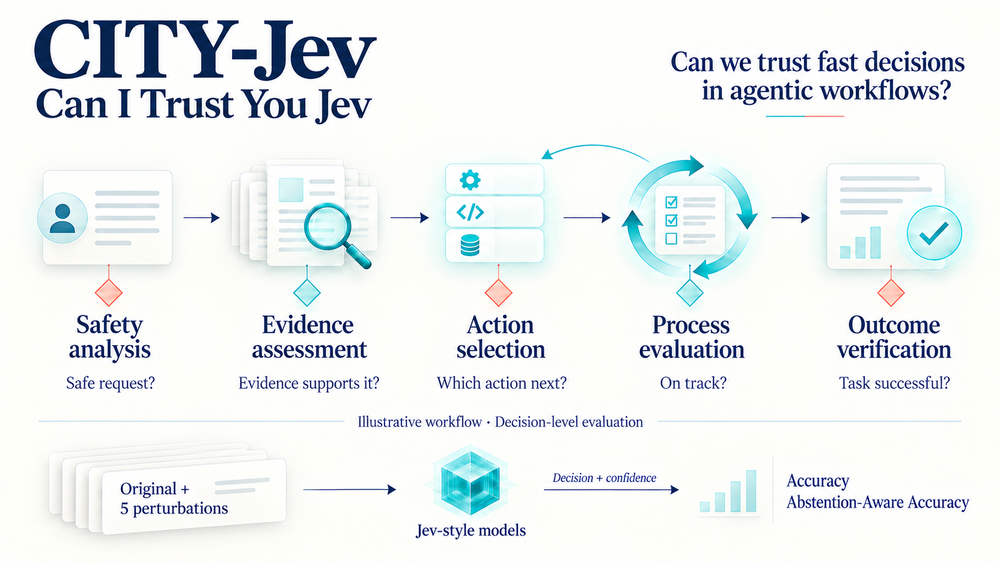

# CITY-Jev: Evaluating Agent Execution Decisions Under Perturbations

**CITY-Jev (Can I Trust You Jev)** asks a simple question: **fast decisions are useful, but can we trust them?** We evaluate [Jev-style System One models](https://typesafe.ai/blog/introducing-system-one-models-and-jev) at typical decision points in general agentic workflows: choosing an action, judging a step, verifying an outcome, assessing evidence, and checking safety. We test whether those decisions are correct, whether they hold up when inputs are reworded or reformatted, and how much confidence-based abstention helps.

[](https://huggingface.co/datasets/KikiNLP/CanITrustYou-Jev)

<p align="center">
  
</p>

*Illustrative workflow. We evaluate adapted candidate-selection decisions using Accuracy and Abstention-Aware Accuracy, with strict (worst-case) and mean scores over the original input and all five perturbations.*

**One question. Six input versions. Does the decision hold up?**

We adapt **13 upstream data sources** in the published `test-v1` split into a common candidate-selection format: **2,437 original questions**, each paired with **five perturbations**, for **14,622 decision evaluations**. The perturbations change option order, option identifiers, state formatting, auxiliary context, or instruction wording, with the aim of preserving the correct answer. We report Accuracy and Abstention-Aware Accuracy using both **worst-case and mean scores** across the six inputs, broken down by application scenario, decision task, answer format, and source dataset.

This is an independent evaluation of adapted tasks; its scores are not the official scores of the upstream benchmarks. The current results cover **seven completed model evaluations on `test-v1`**. An earlier Jev 1.13.0 evaluation used a different 2,000-question dataset and is archived separately below; its scores are not directly comparable. Configurations for other model adapters do not imply completed evaluations.

> **Review status:** This project was developed primarily using automated tools, with partial human involvement and review. Its data transformations, perturbations, evaluation logic, reported results, and documentation require further verification. The current content should be considered preliminary.

## Data Sources

The current `test-v1` split contains **2,437 original questions from 13 sources**. Counts describe adapted questions, not upstream dataset sizes or necessarily independent trajectories. The exact evaluated file and per-source counts are recorded in [the results snapshot](docs/test-v1-results.json).

<details>
<summary>Current test-v1 source counts</summary>

| Dataset ID | Original Questions |
|---|---:|
| `agentprocess` | 450 |
| `agentreward` | 135 |
| `bfcl` | 200 |
| `mind2web` | 203 |
| `weblinx` | 49 |
| `swetraj` | 100 |
| `longmemeval` | 250 |
| `agentharm` | 200 |
| `injecagent` | 250 |
| `longrca` | 200 |
| `rootse` | 100 |
| `trajerrbench` | 200 |
| `telbench` | 100 |
| **Total** | **2,437** |

</details>

<details>
<summary>Historical source descriptions for the initial 2,000-question Jev evaluation</summary>

These counts belong to the initial evaluation, not `test-v1`. Links point to upstream projects or dataset repositories.

| Source | Dataset ID | Questions | Adapted Task and Answer Format | Ground-Truth Basis |
|---|---|---:|---|---|
| [AgentProcessBench](https://github.com/RUCBM/AgentProcessBench) | `agentprocess` | 450 | Process evaluation; fixed-category classification | Upstream step-level process-quality annotations |
| [AgentRewardBench](https://huggingface.co/datasets/McGill-NLP/agent-reward-bench) | `agentreward` | 135 | Success, loop, or side-effect verification; yes/no judgment | Agreement among upstream annotations |
| [BFCL](https://github.com/ShishirPatil/gorilla/tree/main/berkeley-function-call-leaderboard) | `bfcl` | 200 | Function selection; dynamic candidate selection | Correct-function labels from V4 multiple |
| [Mind2Web](https://github.com/OSU-NLP-Group/Mind2Web) | `mind2web` | 203 | Web target selection; dynamic candidate selection | Upstream positive targets and negative candidates |
| [WebLINX](https://github.com/McGill-NLP/weblinx) | `weblinx` | 49 | Web action selection with dialogue context; dynamic candidate selection | Upstream target-action annotations |
| [SWE-agent trajectories](https://huggingface.co/datasets/nebius/SWE-agent-trajectories) | `swetraj` | 100 | Software repair outcome verification; yes/no judgment | Execution outcome labels attached to trajectories |
| [LongMemEval](https://github.com/xiaowu0162/LongMemEval) | `longmemeval` | 250 | Whether evidence supports an answer; yes/no judgment | Oracle evidence and answerability annotations |
| [AgentHarm](https://huggingface.co/datasets/ai-safety-institute/AgentHarm) | `agentharm` | 200 | Request safety analysis; yes/no judgment | Harmful / benign source labels |
| [InjecAgent](https://github.com/uiuc-kang-lab/InjecAgent) | `injecagent` | 250 | Injection attack type identification; fixed-category classification | Upstream attack-type annotations |
| [WorkArena](https://github.com/ServiceNow/WorkArena) | `workarena` | 163 | Consistency between knowledge and an answer; yes/no judgment | Correct values from knowledge-task configurations and rule-generated incorrect values |
| **Total** | | **2,000** | | |

The `gold` answer comes from upstream annotations, execution outcomes, or verifiable rules applied to task configurations. Generative models are used for some expression perturbations, not to generate ground-truth answers. Sampling is limited to locally available data and does not cover every upstream dataset in full. Label distributions are not uniformly balanced.

</details>

### Classification Dimensions

- **Application scenario:** business service interactions, information retrieval and knowledge QA, tool and API interactions, web and browser operations, and software development and repair. Both ordinary and dialogue-based web navigation fall under web and browser operations. AgentProcessBench is classified by its internal task domains.
- **Decision task:** safety analysis, outcome verification, action selection, evidence assessment, and process evaluation.
- **Answer format:** dynamic candidate selection, fixed-category classification, and yes/no judgment. All three use a candidate-selection interface.

### Five Perturbations

Each perturbation is applied independently to the original question. The aim is to change input expression while preserving the meaning of the correct answer.

| Identifier | Perturbation | Input Change |
|---|---|---|
| `v0_original` | Original input | The original question in the common schema |
| `v1_order` | Option order reversal | Reverse candidate IDs and their descriptions together |
| `v2_label` | Option identifier replacement | Use opaque IDs and preserve original labels in nested descriptions, also changing the description structure |
| `v3_format` | State formatting | Serialize the state as JSON text, changing formatting, quotation, or escaping |
| `v4_context` | Irrelevant context insertion | Add auxiliary material about another case and instructions limiting the task scope; auxiliary text is generated per question |
| `v5_paraphrase` | Instruction paraphrasing | Rewrite decision instructions while retaining the intended task |

Generated context and paraphrases may introduce semantic deviations. The perturbations have not undergone exhaustive human verification of semantic equivalence.

## Results

### Current benchmark: test-v1

**Seven models on the same test-v1 input.** All runs contain **14,622 unique records** covering **2,437 questions** and all six versions. The six previously reported models have no failed requests or excluded questions. **Jev 1.13.0 has 14,612 valid responses and 10 retained validation failures**; its scores include **2,428 questions / 14,568 decisions** after excluding 9 affected questions. Results below use the final merged outputs, including retries and repairs for overlong inputs. Valid responses indicate successful evaluation, not necessarily correct answers.

**Mean Accuracy** measures correctness across all six versions. **Strict Accuracy** counts a question as correct only when **all six versions are correct**. Higher is better. Models are sorted by Mean Accuracy; bold marks the best value in each metric column.

Model names link to the original code repositories, or to the provider page for the hosted Jev API; backbones link to their Hugging Face model pages where available. Backbone names identify the checkpoints used in these runs, including the distinction between base and post-trained models. The Jev run records an API model identifier, not a backbone checkpoint.

| Model / Method | Backbone | Mean Accuracy ↑ | Strict Accuracy ↑ |
|---|---|---:|---:|
| [Jev 1.13.0](https://typesafe.ai/blog/introducing-system-one-models-and-jev)‡ | Hosted API; checkpoint not recorded | **66.88%** | **61.70%** |
| [Decider-4B v2.1](https://github.com/Mapika/decider) | [Qwen3.5-4B-Base](https://huggingface.co/Qwen/Qwen3.5-4B-Base) | 54.28% | 45.75% |
| [SemIf](https://github.com/TheoLeeCJ/SemIf-OpenJev)† | [Qwen3.5-4B](https://huggingface.co/Qwen/Qwen3.5-4B) | 51.98% | 37.42% |
| [so1](https://github.com/ikermoel/open-alternative-jev) | [Qwen3.5-4B](https://huggingface.co/Qwen/Qwen3.5-4B) | 51.65% | 36.64% |
| [Kev-4B r10](https://github.com/jaredpalmer/kev) | [Qwen3.5-4B-Base](https://huggingface.co/Qwen/Qwen3.5-4B-Base) | 50.67% | 39.60% |
| [Kev-0.6B](https://github.com/jaredpalmer/kev) | [Qwen3-0.6B-Base](https://huggingface.co/Qwen/Qwen3-0.6B-Base) | 46.31% | 35.00% |
| [Laya (typed-decisions)](https://github.com/NandhaKishorM/laya) | [ModernBERT-large](https://huggingface.co/answerdotai/ModernBERT-large) | 42.27% | 27.78% |

**Evaluation protocol.** Each adapter uses its model's native decision inference. Inputs exceeding the configured context budget are left-clipped. These are single-run results, without repeated-run uncertainty estimates. Jeff remains stopped with partial predictions and is not ranked. No completed thinking-on/off comparison is reported here.

**‡ Jev coverage and reuse:** the 10 retained failures have a returned `choice` whose probability is below the maximum; their raw responses remain unchanged, and there are no remaining network failures. The standard complete-six-version rule excludes all 54 decisions from their 9 questions, so Jev's scoring cohort differs slightly from that of the other models. The v1 result reuses **10,966 unchanged successful records** from the initial evaluation where the input record is identical; missing and failed records were evaluated or retried. Earlier successful responses retain their original configurations. The final Jev implementation starts at an estimated 30,720-token input budget, reduces it by 1,024 on length errors, and uses option-count-aware two-decimal probability-sum tolerance. Its generic state-field truncation can also shorten role/name/ID strings, not only history content; fixed instructions and candidate options are preserved. These results reflect that implementation.

**† SemIf candidate adaptation:** for questions exceeding its native **16-option** limit, distractors are deterministically removed while retaining the gold answer. Its candidate sets therefore differ from those of the other models on these questions; treat its ranking with that qualification.

<details>
<summary>Confidence-based abstention: scores and coverage trade-off</summary>

**AAA = Abstention-Aware Accuracy.** The offline abstention policy passes a decision if it is correct **or** the provider returns `confidence < 0.5`. Strict aggregation requires all six versions to pass. This metric rewards abstention, so a high score does not by itself imply better decisions. We preserve provider confidence rather than replacing it with the maximum class probability; confidence definitions can differ between providers.

| Model / Method | Mean AAA ↑ | Strict AAA ↑ | Abstention Rate |
|---|---:|---:|---:|
| [Jev 1.13.0](https://typesafe.ai/blog/introducing-system-one-models-and-jev)‡ | 84.01% | 78.34% | 27.81% |
| [Decider-4B v2.1](https://github.com/Mapika/decider) | 77.79% | 70.82% | 36.55% |
| [SemIf](https://github.com/TheoLeeCJ/SemIf-OpenJev)† | N/A | N/A | N/A |
| [so1](https://github.com/ikermoel/open-alternative-jev) | 66.26% | 47.44% | 18.44% |
| [Kev-4B r10](https://github.com/jaredpalmer/kev) | 93.34% | 88.59% | 73.10% |
| [Kev-0.6B](https://github.com/jaredpalmer/kev) | 79.79% | 69.63% | 43.59% |
| [Laya (typed-decisions)](https://github.com/NandhaKishorM/laya) | 99.85% | 99.26% | 98.14% |

SemIf does not return the provider confidence required by this policy, so its abstention metrics are unavailable. For example, Laya's high abstention-aware score accompanies a **98.14% abstention rate**, rather than high unconditional accuracy.

</details>

**Data and provenance:** [test-v1.jsonl at the evaluated revision](https://huggingface.co/datasets/KikiNLP/CanITrustYou-Jev/blob/6d2deca3a34c8567cf3e419321a3151ad5381de0/test-v1.jsonl) · [Machine-readable metrics, counts, protocols and per-dataset breakdowns](docs/test-v1-results.json). The input SHA-256 is `800c3815e574889fabf22b6260838cf4c8647e707667624c88f089770d9bf16b`. Aggregate correct counts, unique record coverage, and the stated failure/exclusion counts were checked against the merged predictions. The snapshot includes Jev v1's final metrics, artifact hashes, and reuse notes.

<details>
<summary>Historical Jev 1.13.0 results: initial 2,000-question dataset (not comparable to test-v1)</summary>

The following tables are retained from the initial evaluation. They use different data and must not be compared directly with the six-model table above.

<!-- JEV-ROBUST-RESULTS:START -->
### Initial Jev Evaluation

Model: `jev-1.13.0`. Confidence threshold: **0.5**.

Of **2,000** original questions, **26** are excluded following **56** failed requests, leaving **1,974** questions and **11,844** decision evaluations. If any request fails or any prediction is missing for a question or its perturbations, the entire question is excluded from scoring.

- **Per-decision Accuracy:** 1 if `choice == gold`, otherwise 0.
- **Per-decision Abstention-Aware Accuracy:** 1 if the answer is correct or the API returns `confidence < 0.5`, otherwise 0. Low confidence is treated as abstention by an offline policy; confidence equal to the threshold is treated as answering.
- **Strict score:** take the minimum score across the original input and five perturbations for each question, then average over included questions. All six decisions must pass for a question to score 1.
- **Mean score:** average the six decision scores for each question, then average over included questions.

The threshold of 0.5 follows an example in the [TypeSafe Confidence documentation](https://docs.typesafe.ai/confidence); it is not a mandatory universal threshold. We use the returned `confidence`, not the highest class probability. Abstention-Aware Accuracy is defined for this project and should be read alongside the abstention rate.

Abstention rate across included decisions: **19.37%**.

### By Application Scenario

| Category | Included Questions | Excluded Questions | Strict Accuracy | Mean Accuracy | Strict Abstention-Aware Accuracy | Mean Abstention-Aware Accuracy |
|---|---:|---:|---:|---:|---:|---:|
| Business Service Interactions | 158 | 0 | 50.63% | 53.59% | 62.66% | 67.72% |
| Information Retrieval and Knowledge QA | 565 | 1 | 73.98% | 80.56% | 87.96% | 91.45% |
| Tool and API Interactions | 789 | 0 | 81.50% | 84.37% | 88.72% | 91.21% |
| Web and Browser Operations | 362 | 25 | 70.72% | 75.87% | 83.98% | 89.64% |
| Software Development and Repair | 100 | 0 | 74.00% | 77.67% | 84.00% | 84.67% |
| Overall | 1974 | 26 | 74.52% | 78.92% | 85.31% | 88.78% |

### By Decision Task

| Category | Included Questions | Excluded Questions | Strict Accuracy | Mean Accuracy | Strict Abstention-Aware Accuracy | Mean Abstention-Aware Accuracy |
|---|---:|---:|---:|---:|---:|---:|
| Safety Analysis | 450 | 0 | 84.22% | 87.78% | 90.89% | 93.15% |
| Outcome Verification | 229 | 6 | 74.24% | 78.97% | 82.10% | 85.01% |
| Action Selection | 433 | 19 | 83.14% | 85.80% | 92.38% | 95.73% |
| Evidence Assessment | 413 | 0 | 83.78% | 89.43% | 92.98% | 95.92% |
| Process Evaluation | 449 | 1 | 48.11% | 53.71% | 67.48% | 73.05% |
| Overall | 1974 | 26 | 74.52% | 78.92% | 85.31% | 88.78% |

### By Answer Format

| Category | Included Questions | Excluded Questions | Strict Accuracy | Mean Accuracy | Strict Abstention-Aware Accuracy | Mean Abstention-Aware Accuracy |
|---|---:|---:|---:|---:|---:|---:|
| Dynamic Candidate Selection | 433 | 19 | 83.14% | 85.80% | 92.38% | 95.73% |
| Fixed-Category Classification | 699 | 1 | 61.95% | 66.48% | 76.11% | 80.33% |
| Yes/No Judgment | 842 | 6 | 80.52% | 85.71% | 89.31% | 92.22% |
| Overall | 1974 | 26 | 74.52% | 78.92% | 85.31% | 88.78% |

### By Source Dataset

| Category | Included Questions | Excluded Questions | Strict Accuracy | Mean Accuracy | Strict Abstention-Aware Accuracy | Mean Abstention-Aware Accuracy |
|---|---:|---:|---:|---:|---:|---:|
| agentharm | 200 | 0 | 81.00% | 85.75% | 90.00% | 92.83% |
| agentprocess | 449 | 1 | 48.11% | 53.71% | 67.48% | 73.05% |
| agentreward | 129 | 6 | 74.42% | 79.97% | 80.62% | 85.27% |
| bfcl | 200 | 0 | 100.00% | 100.00% | 100.00% | 100.00% |
| injecagent | 250 | 0 | 86.80% | 89.40% | 91.60% | 93.40% |
| longmemeval | 250 | 0 | 73.20% | 82.53% | 88.40% | 93.27% |
| mind2web | 184 | 19 | 79.89% | 84.78% | 92.93% | 96.65% |
| swetraj | 100 | 0 | 74.00% | 77.67% | 84.00% | 84.67% |
| weblinx | 49 | 0 | 26.53% | 31.63% | 59.18% | 74.83% |
| workarena | 163 | 0 | 100.00% | 100.00% | 100.00% | 100.00% |
| Overall | 1974 | 26 | 74.52% | 78.92% | 85.31% | 88.78% |

<!-- JEV-ROBUST-RESULTS:END -->

</details>

## Running the Evaluation

### 1. Environment Setup

Python 3.9+ is required. From the repository root, create a virtual environment and install all dependencies needed for Jev evaluation:

```bash
python3 -m venv .venv
source .venv/bin/activate
python -m pip install --upgrade pip
python -m pip install tqdm
```

### 2. Jev Evaluation Command

```bash
export JEV_API_KEY='replace-with-your-api-key'
python -m src.eval --model jev --input data/final/versions.jsonl
```

### 3. Notes

- Prepare evaluation data separately. `--input` accepts a JSONL file or a directory containing gzip JSONL shards and a `manifest.json`.
- By default, all questions are evaluated with their five perturbations. Use `--limit-bases 10` to evaluate 10 questions first.
- Jev is accessed through an API; no model weights need to be downloaded. The default model is `jev-1.13.0`. Override the endpoint with `JEV_ENDPOINT`; see [configs/models.json](configs/models.json) for configuration.
- The current Jev configuration enables a user-selected estimated 30,720-token input budget (`"max_input_tokens": 30720`). It removes earlier history and, when necessary, trims text while preserving content near the decision point. The Jev adapter caps explicitly configured budgets at 30,720; set this value to `null` to disable truncation. This is a local estimate, not a verified provider context limit, and may still underestimate the provider's input token count.
- With truncation enabled, Jev retries `max_tokens_exceeded` responses by reducing that sample's estimated budget by 1,024 tokens each time (30,720 → 29,696 → 28,672 → …). It refits the original record, skips budgets producing an identical request, and stops with the provider error if no smaller positive budget can change the state. Successful results record the initial/final budgets and number of length retries. Each new sample starts at the configured budget; other HTTP errors retain their existing retry behavior.
- Local truncation caches token-count contributions for unchanged JSON leaves and the fixed request envelope, avoiding full request serialization on each cut. Escaping and JSON-string states use the same counting rule as the full serialized request. Cuts across multiple fields accumulate until the budget is met; instructions and options remain unchanged. Custom payload transformations fall back to full-payload counting.
- Run `python -m src.eval --help` for additional arguments. Local inference dependencies for other models must be installed separately for their respective adapters.

### Model Scripts and Resume Safety

djev, OpenJev and OpenJev SGLang now call their unchanged, commit-pinned upstream API servers on localhost. Prompt construction, question-ID mapping, canvas sizing, random seeds, sampling, logprob readout and confidence computation run in the upstream code. djev and OpenJev use vLLM; OpenJev SGLang uses its native SGLang launcher and Rust frontend. The default configurations no longer use the handwritten in-process diffusion/SGLang implementations. Those implementations remain available only through explicitly configured experimental `diffusion` / `sglang` backends.

`configs/upstream_sources.json` pins and hashes the upstream sources. OpenJev builds its original Dockerfiles, including its vLLM patches at commit `1b3b88ec2b7457aa030db4d0e7d8aaf04f6d0fb8`. djev uses that compatible structured-diffusion engine revision (djev documents the required vLLM feature, but does not pin an engine commit). SGLang uses the upstream `lmsysorg/sglang:v0.5.19-cu130` image and frozen API dependency lock. Image tags and system package repositories are not immutable; each actual launch records the resulting image ID.

Portable evaluation and server scripts use `script/<name>.sh` and are versioned. Machine-specific weight paths live only in ignored `script/<name>_hgroup.sh` wrappers, which set environment variables and call the portable scripts. On hgroup, use `bash script/serve_djev_hgroup.sh` to serve and `bash script/djev_hgroup.sh` to evaluate (likewise for OpenJev and OpenJev SGLang). Elsewhere, set the corresponding weight environment variable to your checkpoint directory, or pass `--weights` when serving. The server launcher does not read local weight configuration files.

From the repository root, build once, then start the selected backend in the foreground:

```bash
# djev: terminal 1
export DJEV_WEIGHTS=/path/to/diffusiongemma-checkpoint
bash script/serve_djev.sh --build
bash script/serve_djev.sh
# After the API is ready, terminal 2
.venv/bin/python -m src.eval --model djev --input data/final/versions.jsonl --output results/djev-run --limit-bases 10
```

| Model | Build once | Start backend | Run evaluation | Port / endpoint override |
| --- | --- | --- | --- | --- |
| djev | `bash script/serve_djev.sh --build` | `bash script/serve_djev.sh` | `bash script/djev.sh` | 8011 / `DJEV_ENDPOINT` |
| OpenJev | `bash script/serve_openjev.sh --build` | `bash script/serve_openjev.sh` | `bash script/openjev.sh` | 8012 / `OPENJEV_ENDPOINT` |
| OpenJev SGLang | `bash script/serve_openjev_sglang.sh --build` | `bash script/serve_openjev_sglang.sh` | `bash script/openjev_sglang.sh` | 8013 / `OPENJEV_SGLANG_ENDPOINT` |

These commands require Docker with NVIDIA GPU support, compatible CUDA 13 drivers/hardware for the upstream images, and the configured local checkpoints. NVFP4 backends retain upstream hardware requirements. The build step downloads sources, images and dependencies. Servers bind to loopback with `/v1/systemone` endpoints. Use `--dry-run` (also with `--build`) to inspect commands without building or starting anything. Startup accepts `--gpus device=0`, `--port 8011`, and `--weights /absolute/checkpoint/path`; weight environment variables are also accepted. Set the weight variable in both terminals. Use the same weight environment override for serving and evaluation so the recorded evaluation identity describes the mounted checkpoint. Changing a port requires the corresponding evaluation endpoint override. Wait for the upstream API startup/health check before evaluating; the launcher does not signal readiness itself.

The intentional inference-budget exception remains `model_max`: the launcher reads the local checkpoint's backbone limit and passes it to vLLM/SGLang. SGLang's total request budget accommodates prefix warmup plus the single question branch; the original server retains its input validation and output reservations. Other inference defaults remain upstream-owned. Container launch specifications, checkpoint config hashes and actual image IDs are saved under `results/backend-launches/`; these files describe launch attempts, not successful health checks. The HTTP client cannot independently attest the code or weights behind a manually overridden endpoint.

OpenJev retains its entropy-based confidence, independently of djev's confidence policy. The evaluator preserves returned probabilities and confidence without recomputation. `open_alternative_jev` uses native `mode: packed`. Changed backend types and upstream commits are included in resume identity, so results made with the earlier in-process backends require a new output directory.

Evaluation adapters live in `src/model`, with one file per model or inference method:

| Model / method | Module |
| --- | --- |
| Jev HTTP | `jev.py` |
| SemIf | `semif.py` |
| Laya | `laya.py` |
| Jeff | `jeff.py` |
| Kev | `kev.py` |
| open-alternative-jev | `open_alternative_jev.py` |
| djev | `djev.py` |
| OpenJev | `openjev.py` |
| OpenJev SGLang | `openjev_sglang.py` |
| System One-compatible HTTP protocol | `system_one_open.py` |
| Subprocess bridge / mock | `bridge.py` / `mock.py` |

`model_utils.py` contains shared prediction types, errors, probability validation, response persistence helpers, context trimming, environment/path helpers, and token/text utilities. Model-specific prompt construction and inference helpers stay with their adapter. `registry.py` selects adapters and resolves effective configuration; heavyweight inference dependencies are imported only when constructing or running the selected adapter. The former `base.py`, `context.py`, `weights.py`, `local.py`, and `local_open.py` have been replaced; Python callers should use the modules above. CLI model names are unchanged; effective configuration changes intentionally invalidate incompatible resumes.

Run `bash script/<model>.sh` from the repository root. Each script activates its environment and directly executes its Python interpreter (`"$VIRTUAL_ENV/bin/python"`); the `uv` executable is not required at runtime: Jev, djev, Laya, open-alternative-jev, OpenJev and Kev use `.venv`; SemIf uses `.venv-semif`, Jeff uses `.venv-jeff`, and openjev-sglang uses `.venv` for its HTTP client. The three served backends keep their inference dependencies in Docker. Install the corresponding inference dependencies in these environments beforehand; activation does not install them.

Set `JEV_API_KEY` externally before running `bash script/jev.sh`; the script preserves it. Jeff uses the local Qwen3-4B-Instruct-2507 base and `GestaltLabs/Jeff-1` from the Hub by default; set `JEFF_WEIGHTS` to a downloaded Jeff-1 adapter directory to use local weights. SemIf and open-alternative-jev use the local `Qwen/Qwen3.5-4B` snapshot `851bf6e806efd8d0a36b00ddf55e13ccb7b8cd0a`, matching [SemIf's pinned direct-logit baseline](https://github.com/TheoLeeCJ/SemIf-OpenJev/blob/master/THIRD_PARTY.md) and the model used by the [official open-alternative-jev 4B demo](https://huggingface.co/spaces/IkerMoel/open-alternative-jev/blob/main/README.md). The latter library also supports other models; this configuration targets its 4B reference, not its Qwen3.6-27B benchmark. Override the local path with `SEMIF_MODEL` or `SO1_WEIGHTS` only when intentionally changing the checkpoint; the effective configuration is recorded for resume checks.

All local adapters default to `context_policy: model_max`: they read the actual loaded text backbone's context limit (including nested `text_config`) instead of using fixed 2K/4K/8K defaults. Tokenizer sentinel lengths and unconfigured RoPE extensions are not treated as supported context. Laya applies the encoder limit to its total sequence budget and retains its separate head budget; Jeff updates the native client's prompt limit and reserves label tokens when sequence readout is needed; SemIf passes the resolved limit to its scorer. The so1 adapter checks the fully rendered prompt. The three upstream services enforce their own request budgets after the launcher sets the backbone context limit. Optional numeric `max_len` (Laya/Kev) or `max_tokens` (other local adapters) overrides must fit within the resolved maximum.

Kev uses the loaded backbone's position limit as its total state-plus-question row budget. It measures the instruction and option branch first, reserves that space, and truncates the state to the remainder. Per-prediction context metadata records the branch size, state budget, and whether truncation occurred. The upstream packed-sequence threshold remains unchanged, so longer requests use Kev's causal-row inference path.

For in-process native adapters, the resolved backbone limit, reserved tokens, and input budget are saved as `runtime_context` in `run.json`; Jeff also records its per-question label reservation in response metadata. Resume rejects a changed resolved context before rewriting predictions, and runs created under the earlier fixed-limit configuration require a new output directory. For served backends, use the separate backend launch manifest to audit actual context settings; the HTTP client does not populate `runtime_context`. These are checkpoint-supported limits, not measured guarantees that the current GPU can fit a maximum-length input. HTTP Jev retains its separate configured input budget.

Scripts accept additional CLI arguments, for example `bash script/semif.sh --limit-bases 10`. Resume with `--output <existing-directory> --resume`. Before loading a model or rewriting predictions, the evaluator checks the model, effective configuration (including non-secret environment overrides), input hash, version set, and sample limit. Older runs without this identity record cannot be resumed automatically; use a new output directory. API keys are not stored in the identity.

Metrics exclude an entire question if any of its six predictions is missing or failed. Abstention metrics use returned provider confidence, strictly below 0.5; if any included decision lacks confidence, these metrics are `null` rather than substituting class probabilities.

All adapters share an option-count-aware probability-sum check: tolerance is `K * 0.5 * 10**(-decimals) + 1e-12` for `K` options. The default remains four decimal places (`K * 0.00005 + 1e-12`). Jev explicitly configures `probability_decimals: 2` to accommodate the observed two-decimal outputs, giving tolerance 0.05 for 10 options and 0.08 for 16 options (plus floating-point slack). This is a declared validation policy; precision is never inferred from individual response values. The supported range is 2–255 options. Probabilities and raw responses are preserved without renormalization. Missing options, non-finite or out-of-range probabilities, non-maximal choices, and invalid confidence remain errors. Failures report the sum, option count, and tolerance. Changing precision changes the effective run identity; failed samples can be retried in a new attempt while successful results are explicitly reused with provenance.

## Scope and Limitations

- These scores measure adapted candidate-selection decisions, not end-to-end agent success. BFCL measures function selection only; Mind2Web uses candidate sets containing the correct target; WorkArena measures knowledge-value consistency without executing browser tasks.
- LongMemEval uses oracle evidence and does not measure full long-context retrieval. The InjecAgent samples contain known attacks, so they cannot establish false-positive rates on benign inputs.
- Source sizes and label distributions differ. Overall scores are weighted by question count. Multiple questions may share a trajectory or underlying problem and should not be treated as fully independent samples.
- Input truncation was enabled with an estimated 32,000-token budget for this evaluation; 1,573 of the 12,000 prediction records contain actual truncation metadata. Of the 26 questions excluded due to failed requests, 25 belong to web and browser operations. The tables describe performance on the included questions.
- Abstention-Aware Accuracy gives full credit for either a correct answer or low-confidence abstention. Interpret it together with Accuracy, the abstention rate, and the confidence threshold. Results come from one run and do not include uncertainty estimates across repeated runs.

## Citation and Acknowledgments

If you use this project's methods, code, or results, you can cite the repository:

```bibtex
@misc{canitrustujev2026,
  author       = {{CanITrustU-Jev}},
  title        = {CITY-Jev: Evaluating Agent Execution Decisions Under Perturbations},
  year         = {2026},
  howpublished = {\url{https://github.com/JiaQiSJTU/CanITrustU-Jev}},
  note         = {GitHub repository}
}
```

This project builds on the 10 upstream sources listed above. When using their data or adapted examples, also cite the relevant upstream projects or papers and follow their respective licenses and usage terms. Citing this repository does not replace upstream attribution. The confidence-based abstention policy draws on the [TypeSafe Confidence documentation](https://docs.typesafe.ai/confidence).
